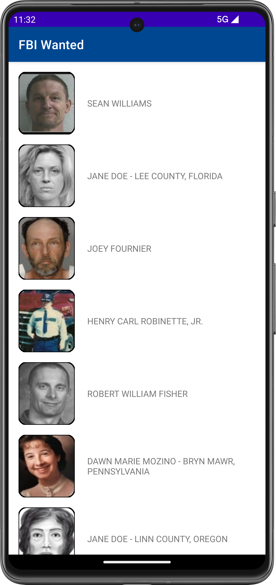
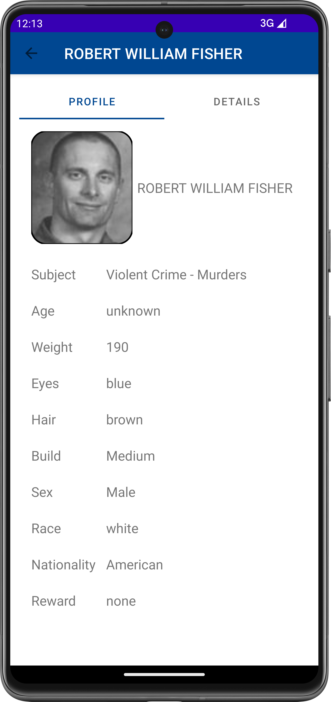
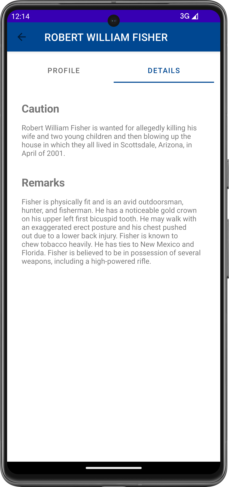

### 2023. 10. 21.
### FBI WANTED

## Main Screen

The main screen shows previews of people on the FBI list. Here I used the Glide library to download the images and displayed the images in a ShapeableImageView element. Thanks to this UI element, I could easily customize the outline of the images. The application implements an infinite scrolling function, with the help of which it continuously loads new people as we scroll down (to solve this, I used RecyclerView's onScrolled callback).

## Profile view

In this fragment, the image is displayed in a similar way as on the main screen. We can get more information about the selected person.

## Details view

In another fragment of Viewpager, we can get information about a crime committed or a missing person (or similar details); and additional information about the person.